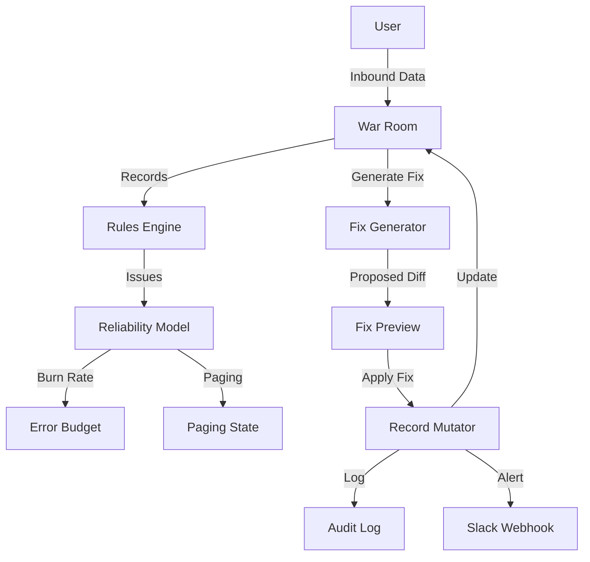

# Revenue Leak SRE

**Revenue Leak SRE** transforms your Go-To-Market (GTM) team into a Reliability Engineering discipline. 
We treat **revenue leaks** (untouched leads, stale deals) as **incidents** that burn down an **Error Budget**.

## 🚀 The Vision
Most RevOps tools are passive dashboards. We are an **Incident Command System**.
1.  **Define SLOs**: "Leads must be touched in 30m". "Deals cannot sit in Proposal for > 7 days".
2.  **Monitor Burn Rate**: If your team ignores leads, you burn your Revenue Error Budget.
3.  **Page the Team**: When burn rate > 50%, we escalate to "Page" status.
4.  **Auto-Remediate**: We generate **Fix Packs** (automation payloads) to resolve the incident instantly.

## 📸 Capabilities
-   **War Room**: Real-time view of Active Incidents, Burn Rate, and Impact Blast Radius.
-   **Fix Packs**: Automated resolution (e.g., "Assign Owner", "Rescue Stale Opp") with `git diff` style previews.
-   **Audit Log**: Immutable history of every action for compliance.

## ⚡ Quick Start
```bash
# 1. Install
git clone https://github.com/developer-2046/Revenue-Leak-SRE.git
cd Revenue-Leak-SRE
npm install

# 2. Run
npm run dev
# Open http://localhost:3000
```

## 🎥 The "Must-Win" Demo
1.  **Click "RUN FULL DEMO"** (Big Purple Button).
2.  **War Room Activation**: Watch the dashboard transform into an Incident Command Center.
    -   **SEV 1 Incident** declared.
    -   **Budget at Risk** climbs.
    -   **Paging State** hits "PAGE".
3.  **Resolve**:
    -   Click the top issue (Likely "Nakatomi Deal").
    -   Review the **Fix Pack Preview** (Diff view).
    -   Click **"Approve & Apply"**.
4.  **Recovery**:
    -   Watch the **Timeline** update.
    -   See the **Error Budget** stabilize.
    -   Incident resolves.

## 🏗 Architecture


## 🧪 Quality Gates
-   **Tests**: `npm run test` (Vitest covering Logic, Rules, Impact)
-   **Lint**: `npm run lint`
-   **CI**: GitHub Actions workflow enabled.

See [docs/RELIABILITY_MODEL.md](docs/RELIABILITY_MODEL.md) for the math behind the metrics.
