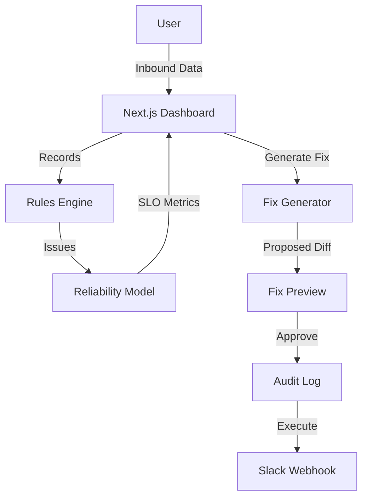

# Revenue Leak SRE

**Revenue Leak SRE** is a proactive observability and remediation platform for Go-To-Market (GTM) funnels. It applies Site Reliability Engineering (SRE) principles to sales operations, using **SLOs** and **Error Budgets** to ensure no lead is left behind.

## 🚀 60-Second Pitch
Most revenue teams rely on passive dashboards. Revenue Leak SRE is different:
1.  **It Monitors Reliability**: Tracks "Revenue Error Budgets" (e.g., Lead Response Time < 1h).
2.  **It Fixes Itself**: Generates "Fix Packs" (automation payloads) to resolve issues.
3.  **It Audits Everything**: GitOps-style audit logs for every data change.

## 📸 Screenshots
*(Placeholders - see live demo)*
-   **Reliability Dashboard**: shows Error Budget burn down.
-   **Fix Pack Preview**: shows Before/After diffs of CRM data.

## ⚡ Quick Start
```bash
# 1. Install
git clone https://github.com/developer-2046/Revenue-Leak-SRE.git
cd Revenue-Leak-SRE
npm install

# 2. Run
npm run dev
# Open http://localhost:3000
```

## 🎥 5-Minute Demo
1.  Click **"Run Full Demo"** to load a deterministic scenario.
2.  Observe the **Error Budget** (Red/Green status).
3.  Click a **High Severity Leak**.
4.  Review the **Fix Pack Preview** (Diff view).
5.  Click **"Approve & Apply"** to execute the fix and log it to the Audit Trail.

## 🏗 Architecture


## 🧪 Quality
-   **Tests**: `npm run test` (Vitest)
-   **Lint**: `npm run lint`
-   **CI**: GitHub Actions enabled.

See [docs/RELIABILITY_MODEL.md](docs/RELIABILITY_MODEL.md) for the math behind the metrics.
